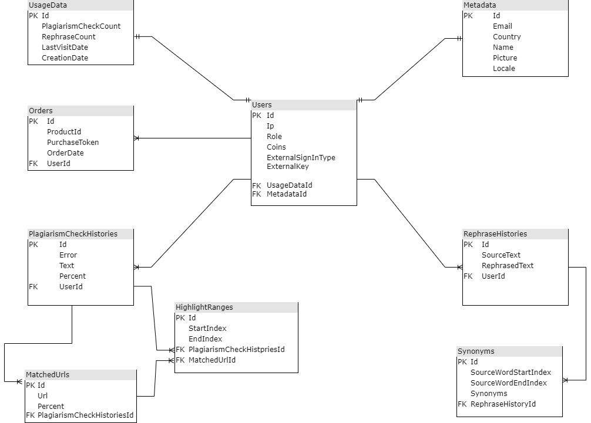

# Synword

## Строки подключения
1. Для инициализации подключения к MS SQL Server необходимо включить пользовательские секреты. Данную команду необходимо прописать внутри PublicApi проекта

    ```
    dotnet user-secrets init
    ```

1. Определение строки подключения

    ```json
    dotnet user-secrets set "UserDataConnection" "Server=Server=(localdb)\\mssqllocaldb;Integrated Security=true;Initial Catalog=Synword.UserDataDb"
    ```

## Создание БД

1. Для начала создадим миграцию в окне Package Manager Console
с помощью команды:

    ```
    add-migration InitialMigration -Context UserDataContext -OutputDir "Data/Migrations"
    ```
1. Применение миграции:

    ```
    update-database -Context UserDataContext
    ```

## Database model

